<!-- markdownlint-disable -->
<p align="center">
  
</p>
<h1 align="center">jerry-up · lala · lala boot</h1>
<h4 align="center">Spring Boot 架构的服务端</h4>
<p align="center">
    
    <a href="./LICENSE" target="_blank">
        
    </a>
</p>
<p align="center">
    <a href="https://docs.spring.io/spring-boot/docs/2.7.14/reference/html" target="_blank">
        
    </a>
</p>

## 1. 项目简介

汇聚后端开发中常用的技术，功能，场景，提供使用样例。

| 项目                                                   | 仓库地址                                            | 说明                     |
| ------------------------------------------------------ | ------------------------ | ------------------------ |
| framework | [](https://gitee.com/jerry_up_lala/framework) [](https://github.com/jerry-up-lala/framework)| 基础框架     |
| lala-boot-web | [](https://gitee.com/jerry_up_lala/lala-boot-web) [](https://github.com/jerry-up-lala/lala-boot-web) | 配套前端 |

## 2. 目录说明

```sh
lala-boot
    └──apidoc #接口文档
    └──assets #附件
    └──boot #服务端代码
    │   └─src
    │      └─main
    │      │  └─java
    │      │     └─com.jerry.up.lala.boot
    │      │        │  ├─access #访问权限码
    │      │        │  ├─bo #业务对象
    │      │        │  ├─component #组件
    │      │        │  ├─config #配置
    │      │        │  ├─constant #常量
    │      │        │  ├─ctrl #控制层
    │      │        │  ├─dto #数据交互对象
    │      │        │  ├─entity #实体
    │      │        │  ├─enums #枚举
    │      │        │  ├─error #错误码
    │      │        │  ├─listener #监听
    │      │        │  ├─mapper #mapper
    │      │        │  ├─properties #配置
    │      │        │  ├─service #业务层
    │      │        │  └─vo #视图对象
    │      │        └──**App #服务启动类  
    │      └────resources
    │               ├─excel #Excel模板文件
    │               ├─gen #代码生成模板
    │               ├─mapper #mybatis mapper xml文件
    │               ├─banner.txt #欢迎页
    │               └─bootstrap.yml #配置文件
    ├──deploy #部署脚本
    │    ├─docker #docker环境部署
    │    ├─jar #jar方式部署
    │    ├─k8s #kuberntes环境部署
    │    └─compile.sh #编译脚本
    ├──nacos #nacos配置文件
    └──sql #sql脚本
```

## 3. 包含功能

| 功能       | 说明                                                         |
| ---------- | ------------------------------------------------------------ |
| 工作台     | 请求日志统计，个人信息，个人通知，快捷入口                   |
| crud样例   | 提供MySQL数据库增删改查样例，包含`原生模式`，`组件模式`，`脚手架模式`等三种风格样例 |
| http样例   | 提供发送Http请求样例                                         |
| 线程池样例 | 提供线程池参数配置样例                                       |
| Redis      | 提供Redis数据库增删改查以及编辑有效期样例，支持`String`，`List`，`Set`，`ZSet`，`Hash`等五种数据类型 |
| 消息队列   | 提供RocketMQ消息队列生产消费样例                             |
| 系统管理   | 提供集团管理，菜单管理，用户管理，角色管理，通知管理等后台系统配置基本功能 |
| 开发工具   | 提供请求日志，字典管理，代码生成等研发常用工具               |
| 个人中心   | 提供个人信息维护，个人通知管理功能                           |

## 4. 初始化环境

### 4.1. 安装中间件

> 可通过[lala-tool](https://github.com/jerry-up-lala/lala-tool)基于docker或者参照[中间件安装](https://jerry-up-blog.pages.dev/tool/middleware/)初始化环境，亦可自行安装如下版本中间件。

| 名称                                        | 版本                                                         |
| ------------------------------------------- | ------------------------------------------------------------ |
| [MySQL](https://www.mysql.com/)             | [5.7.36](https://dev.mysql.com/doc/relnotes/mysql/5.7/en/news-5-7-36.html) |
| [Redis](https://redis.io)                   | [6.2.13](https://github.com/redis/redis/releases/tag/6.2.13) |
| [Nacos](https://nacos.io/zh-cn/)            | [2.2.0](https://github.com/alibaba/nacos/releases/tag/2.2.0) |
| [RocketMQ](https://rocketmq.apache.org/zh/) | [5.0.0](https://github.com/apache/rocketmq/releases/tag/rocketmq-all-5.0.0) |

### 4.2. 初始化数据库

> 执行 `./sql/v1.0.0.sql` ，会自动创建`lala_boot`数据库并初始化表结构以及数据。

```sh
# 替换如下命令 对应的 ip，端口，用户名，密码。
mysql -h127.0.0.1 -P3306 -uroot -p123456 < ./sql/v1.0.0.sql
```

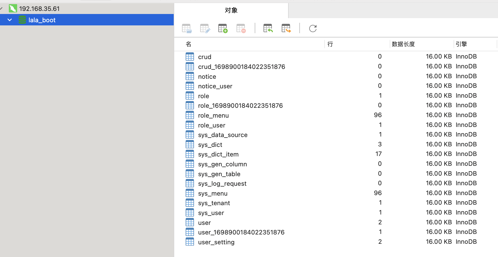

### 4.3. 初始化Nacos配置

> `./nacos`文件夹下，以`Group`为文件夹，`Data ID`为文件名。

1. 在`./nacos/LALA_BOOT_GROUP`文件夹下新增`env.***.yaml`配置文件，根据实际的环境进行参数配置。

   > 样例配置文件参考`./nacos/LALA_BOOT_GROUP/env.192.168.35.61.yaml`。

   | 配置项 | 说明 |
   | ------ | ---- |
   |env.mysql.host|MySQL地址|
   |env.mysql.username|MySQL用户名|
   |env.mysql.password|MySQL密码|
   |env.redis.host|Redis地址|
   |env.redis.password|Redis密码|
   |env.rocketmq.nameServer|RocketMQ地址|
   |env.druid.username|Druid用户名|
   |env.druid.password|Druid密码|
   |env.token.activityTimeout|最低活跃频率，单位/秒|
   |env.token.jwtSecretKey|jwt秘钥|
   |env.token.redis.host|Sa-Token独立使用的Redis地址|
   |env.token.redis.port|Sa-Token独立使用的Redis端口|
   |env.token.redis.password|Sa-Token独立使用的Redis密码|
   |env.token.redis.database|Sa-Token独立使用的Redis数据库索引|
   |env.access|接口是否校验访问权限|
   |env.log.mq|请求日志是否发送至消息队列|
   |env.log.print|请求日志是否打印|
   |env.mail.host|邮件发信主机|
   |env.mail.port|邮件发信端口|
   |env.mail.from|邮件发信人邮箱|
   |env.mail.user|邮件发信人账号|
   |env.mail.pass|邮件发信人密码|
   |env.mail.subjectPrefix|邮件发信主题|
   |env.upload.max|上传Excel最大条数|
   |env.upload.partition|上传Excel批量处理分区大小|
   |env.error.catchPrint|捕获异常打印|
   |env.error.servicePrint|业务异常打印|
   |env.error.runTimePrint|运行时异常打印|
   |env.error.mail.open|异常是否邮件提醒|
   |env.error.mail.level|异常邮件提醒级别|
   |env.error.mail.receivers|异常邮件收件人|
   |env.api.doc|接口文档地址|
   |env.api.count|接口文档数量|

2. 将`./nacos/LALA_BOOT_GROUP`文件夹进行压缩，导入至Nacos。

   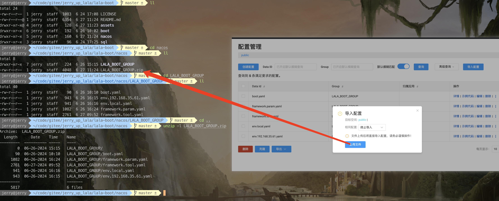

## 5. 本地开发

### 5.1. 前置准备

#### 5.1.1. JDK

项目需要JDK8

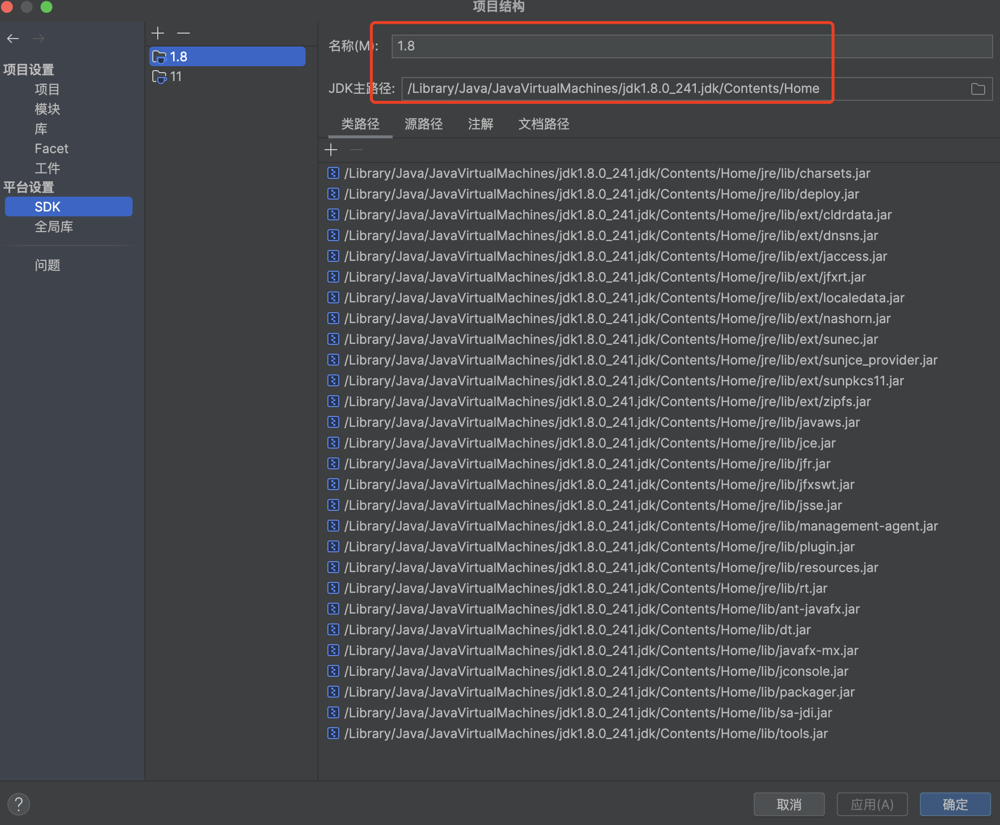

#### 5.1.2. Maven

> 使用Maven进行依赖管理，默认使用阿里云效提供的[免费制品仓库](https://jerry-up-blog.pages.dev/tool/env/repository.html#_2-1-maven%E4%BB%93%E5%BA%93)。

- 方式一，替换`pom.xml`中地址为自己使用的Maven地址，并推送framework基础依赖包至Maven仓库。

- 方式二，修改`settings.xml`为如下配置（只有拉取代码权限，无推送权限）。

```xml
<?xml version="1.0" encoding="UTF-8"?>

<settings xmlns="http://maven.apache.org/SETTINGS/1.0.0"
    xmlns:xsi="http://www.w3.org/2001/XMLSchema-instance"
    xsi:schemaLocation="http://maven.apache.org/SETTINGS/1.0.0 http://maven.apache.org/xsd/settings-1.0.0.xsd">

    <localRepository>/Applications/code-tool/maven/repository</localRepository>

    <servers>
        <server>
            <id>rdc-releases</id>
            <username>65edb330dfac75d8a9644531</username>
            <password>xh10uWIOTOHV</password>
        </server>

        <server>
            <id>rdc-snapshots</id>
            <username>65edb330dfac75d8a9644531</username>
            <password>xh10uWIOTOHV</password>
        </server>
    </servers>

    <mirrors>
        <mirror>
          <id>mirror</id>
          <mirrorOf>central,jcenter,!rdc-releases,!rdc-snapshots</mirrorOf>
          <name>mirror</name>
          <url>https://maven.aliyun.com/nexus/content/groups/public</url>
        </mirror>
    </mirrors>

    <profiles>
        <profile>
            <id>rdc</id>
            <properties>
                <altReleaseDeploymentRepository>
                    rdc-releases::default::https://packages.aliyun.com/maven/repository/2365883-release-DDVVbg/
                </altReleaseDeploymentRepository>
                <altSnapshotDeploymentRepository>
                    rdc-snapshots::default::https://packages.aliyun.com/maven/repository/2365883-snapshot-3GEFXp/
                </altSnapshotDeploymentRepository>
            </properties>
        </profile>
    </profiles>

    <activeProfiles>
        <activeProfile>rdc</activeProfile>
    </activeProfiles>


</settings>
```

### 5.2. 项目导入

```sh
git clone https://github.com/jerry-up-lala/lala-boot.git
```

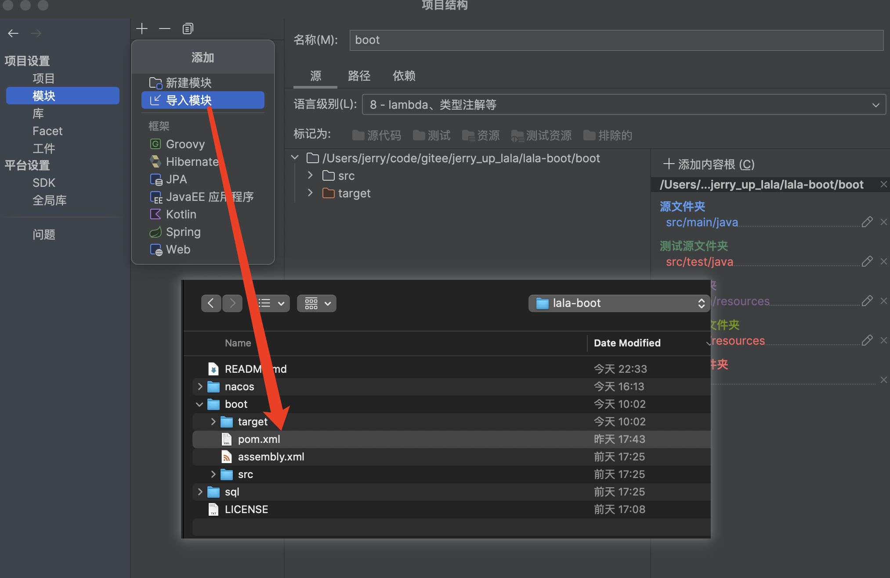

### 5.3. 启动

#### 5.3.1. 设置环境变量

 ```sh
 # 环境变量样例
 DATA_PATH=/Users/jerry/root/root/data/lala;NACOS_CONFIG_HOST=192.168.35.61:8848;NACOS_CONFIG_ENV=env.192.168.35.61.yaml
 ```

| 变量名            | 说明         | 样例值                           | 默认值         |
| ----------------- | ------------ | -------------------------------- | -------------- |
| DATA_PATH         | 数据存放路径 | /Users/jerry/root/root/data/lala | /data          |
| NACOS_CONFIG_HOST | 配置中心地址 | 192.168.35.61:8848               | 127.0.0.1:8848 |
| NACOS_CONFIG_ENV  | 配置环境     | env.192.168.35.61.yaml           | env.local.yaml |

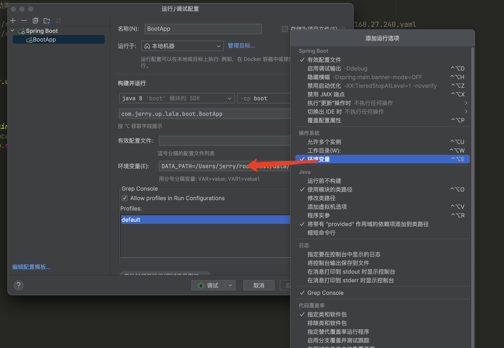

- DATA_PATH

  > 系统产生的数据存放路径，例如 系统日志，默认为 `/data`。

  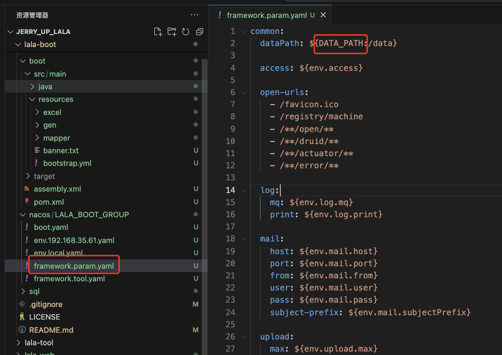

  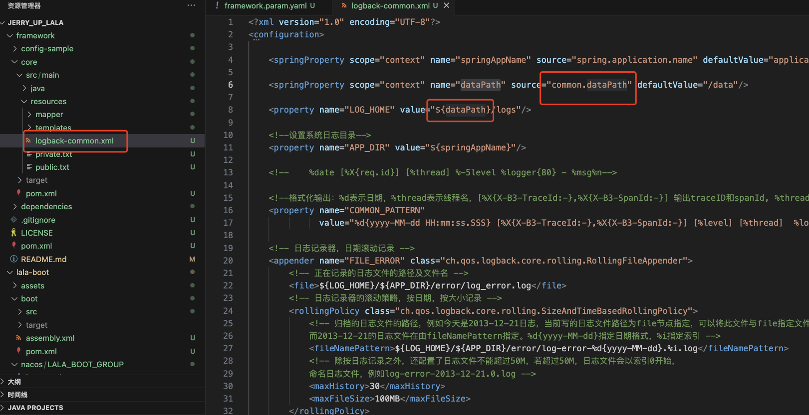

- NACOS_CONFIG_HOST

  > 指定Nacos配置中心地址，默认为`127.0.0.1:8848`。

  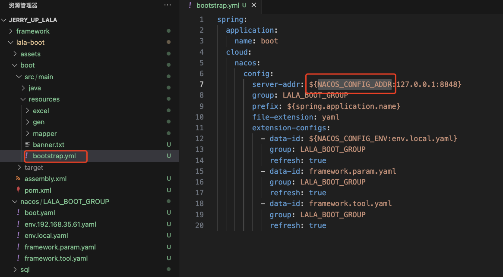

- NACOS_CONFIG_ENV

  > 指定Nacos配置引用`data-id`，与`4.2.2.1. 初始化Nacos配置`中创建的配置文件名保持一致，默认为`127.0.0.1:8848`。

  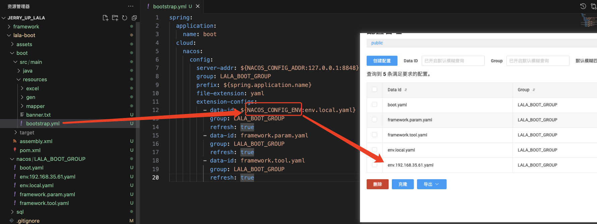

#### 5.3.2. idea启动应用

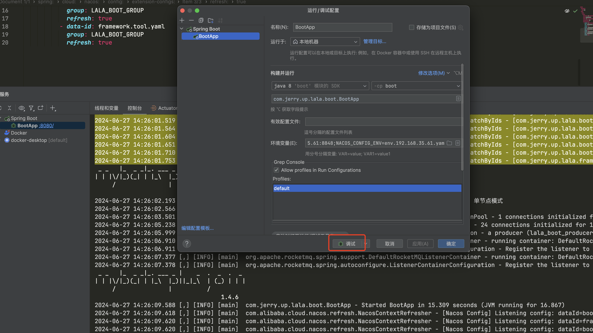

#### 5.3.3. 验证接口

> 系统管理员默认用户名为`admin`, 密码为`lala`。

```sh
curl --location --request POST 'http://localhost:8080/open/sys/login' \
--header 'Content-Type: application/json' \
--data-raw '{
    "loginName": "admin",
    "passWord": "lala"
}'
```

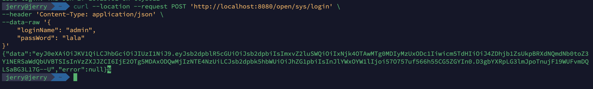

#### 5.3.4. 接口文档

[【1】在线文档](https://jerry-up-lala-boot.apifox.cn)

[【2】离线文档](./apidoc/lala-boot.html)

## 6. 部署

> 提供`java -jar`，`docker run`，`k8s` 3种部署模式。

### 6.1. jar方式部署

> 进入 `deploy/jar`目录，进行如下操作。会在配置的部署文件夹路径生成jar包，启动脚本，停止脚本。

1. 修改`jar.properties`配置文件。

   | 变量名            | 说明                              | 默认值                                 |
   | ----------------- | --------------------------------- | -------------------------------------- |
   | DEPLOY_DIR        | 部署文件夹，jar包以及运行脚本路径 | /Users/jerry/Desktop/jerry_up_lala/jar |
   | NACOS_CONFIG_HOST | 配置中心地址                      | 192.168.35.61:8848                     |
   | NACOS_CONFIG_ENV  | 配置环境                          | env.192.168.35.61.yaml                 |
   | POM_VERSION       | pom文件版本                       | 1.0.0                                  |

2. 运行`jar.sh`，会编译`boot`并将编译后的文件以及部署脚本放至部署文件夹。

   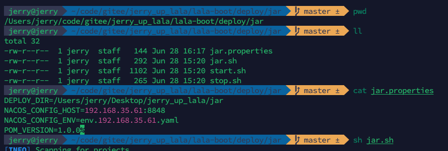

3. 切换至部署文件夹，运行`sh start.sh`。

   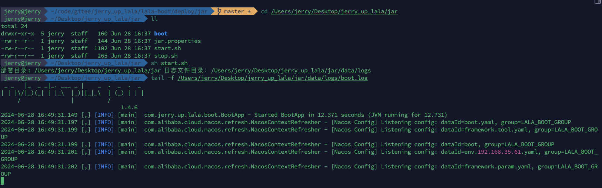

### 6.2. docker方式部署

> 进入 `deploy/docker`目录，进行如下操作。会编译代码并上传镜像至仓库，在配置的部署文件夹路径生成启动脚本，停止脚本。

1. 修改`docker.properties`配置文件。

   > :heavy_exclamation_mark: docker镜像仓库默认配置需要登录权限，请替换为自己的私有镜像仓库。也可以使用阿里云提供的[免费docker镜像仓库](https://jerry-up-blog.pages.dev/tool/env/repository.html#_2-1-docker%E9%95%9C%E5%83%8F%E4%BB%93%E5%BA%93)。

   | 变量名            | 说明                     | 默认值                                     |
   | ----------------- | ------------------------ | ------------------------------------------ |
   | DEPLOY_DIR        | 部署文件夹，运行脚本路径 | /Users/jerry/Desktop/jerry_up_lala/docker  |
   | NACOS_CONFIG_HOST | 配置中心地址             | 192.168.35.61:8848                         |
   | NACOS_CONFIG_ENV  | 配置环境                 | env.192.168.35.61.yaml                     |
   | POM_VERSION       | pom文件版本              | 1.0.0                                      |
   | DOCKER_REGISTRY   | Docker镜像仓库地址       | registry.cn-hangzhou.aliyuncs.com/jerry-up |

2. 运行`docker.sh`，会编译`boot`并根据`Dockerfile`生成进行上传至镜像仓库，并将部署脚本放至部署文件夹。
   
   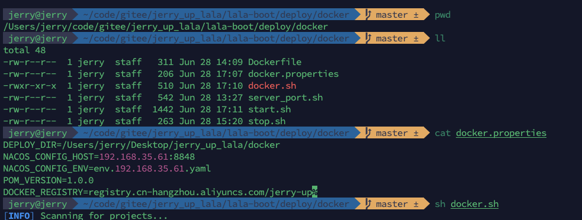

3. 切换至部署文件夹，运行`sh start.sh`。

   >  :bulb: 启动之前会运行`server_port.sh`脚本，从`8080`端口开始寻找空闲端口作为映射宿主机端口。

   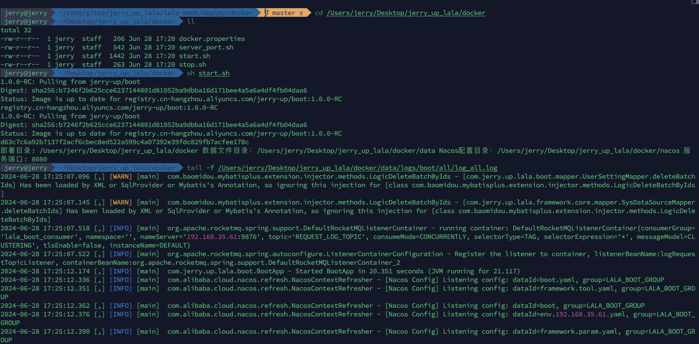

### 6.3. k8s方式部署

> 进入 `deploy/k8s`目录，进行如下操作。会编译代码并上传镜像至仓库，并在部署文件夹路径生成编排文件，启动脚本，停止脚本。

1. 修改`k8s.properties`配置文件。
   > :heavy_exclamation_mark: docker镜像仓库默认配置需要登录权限，请替换为自己的私有镜像仓库。也可以使用阿里云提供的[免费docker镜像仓库](https://jerry-up-blog.pages.dev/tool/env/repository.html#_2-1-docker%E9%95%9C%E5%83%8F%E4%BB%93%E5%BA%93)。

   | 变量名            | 说明                     | 默认值                                     |
   | ----------------- | ------------------------ | ------------------------------------------ |
   | DEPLOY_DIR        | 部署文件夹，运行脚本路径 | /Users/jerry/root/root/data/lala           |
   | NACOS_CONFIG_HOST | 配置中心地址             | 192.168.35.61:8848                         |
   | NACOS_CONFIG_ENV  | 配置环境                 | env.192.168.35.61.yaml                     |
   | POM_VERSION       | pom文件版本              | 1.0.0                                      |
   | DOCKER_REGISTRY   | Docker镜像仓库地址       | registry.cn-hangzhou.aliyuncs.com/jerry-up |

2. 根据不同的操作系统运行`k8s_mac.sh`或者`k8s_linux.sh`，会编译`boot`并根据`Dockerfile`生成进行上传至镜像仓库，并将编排文件，部署脚本放至部署文件夹。

   > :bulb: 由于sed命令在macOS以Linux操作系统存在差异，请根据不同操作系统运行不同的脚本。

   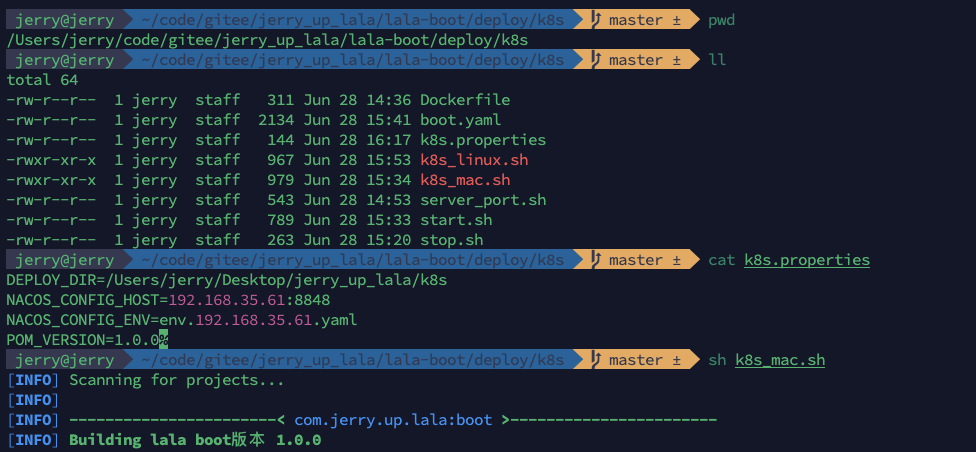

3. 切换至部署文件夹，运行`sh start.sh`。

   > :bulb: 启动之前会运行`server_port.sh`脚本，从`30010`端口开始寻找空闲端口作为k8s Service `nodePort`端口。

   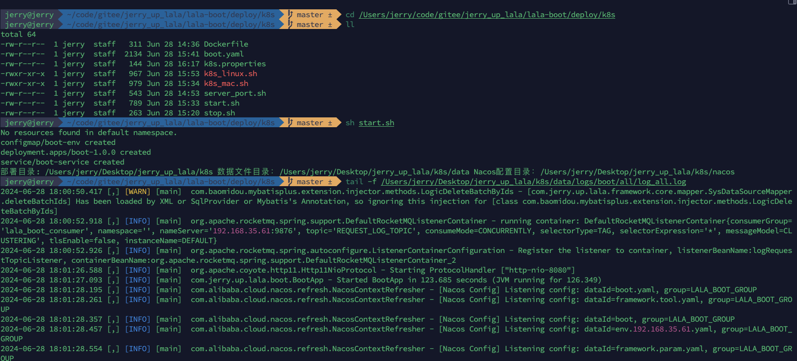